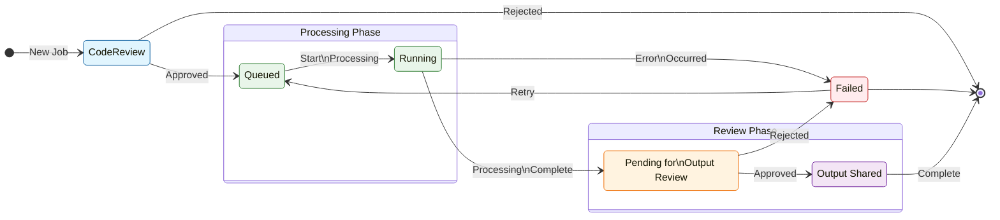

```mermaid
stateDiagram-v2
    direction LR
    
    %% Style definitions
    classDef initial fill:#e1f5fe,stroke:#01579b
    classDef process fill:#e8f5e9,stroke:#2e7d32
    classDef review fill:#fff3e0,stroke:#ef6c00
    classDef error fill:#ffebee,stroke:#c62828
    classDef complete fill:#f3e5f5,stroke:#6a1b9a
    
    state "CodeReview" as pending_for_approval
    state "Queued" as queued
    state "Running" as running
    state "Failed" as failed
    state "Pending for\nOutput Review" as pending_for_output_review
    state "Output Shared" as output_shared
    
    [*] --> pending_for_approval: New Job
    
    pending_for_approval --> queued: Approved
    pending_for_approval --> [*]: Rejected
    
    queued --> running: Start\nProcessing
    
    running --> failed: Error\nOccurred
    running --> pending_for_output_review: Processing\nComplete
    
    failed --> queued: Retry
    failed --> [*]
    
    pending_for_output_review --> output_shared: Approved
    pending_for_output_review --> failed: Rejected
    
    output_shared --> [*]: Complete
    
    %% Apply styles
    class pending_for_approval initial
    class queued,running process
    class pending_for_output_review review
    class failed error
    class output_shared complete

    %% Composite states
    state "Processing Phase" as processing {
        queued
        running
    }
    
    state "Review Phase" as review {
        pending_for_output_review
        output_shared
    }
```